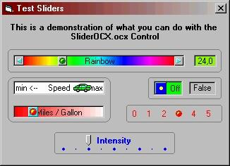



## Slider Construction Kit

### Description

Replacement for the standard Scrollbar with own pictures for the buttons, thumb and body and with quite a few more properties.
 
### More Info
 

             |
---                |---
**Submitted On**   |2002-03-12 21:21:04
**By**             |[ULLI](https://github.com/Planet-Source-Code/PSCIndex/blob/master/ByAuthor/ulli.md)
**Level**          |Advanced
**User Rating**    |4.6 (60 globes from 13 users)
**Compatibility**  |VB 6\.0
**Category**       |[Custom Controls/ Forms/  Menus](https://github.com/Planet-Source-Code/PSCIndex/blob/master/ByCategory/custom-controls-forms-menus__1-4.md)
**World**          |[Visual Basic](https://github.com/Planet-Source-Code/PSCIndex/blob/master/ByWorld/visual-basic.md)
**Archive File**   |[Slider\_Con617563132002\.zip](https://github.com/Planet-Source-Code/ulli-slider-construction-kit__1-32642/archive/master.zip)

